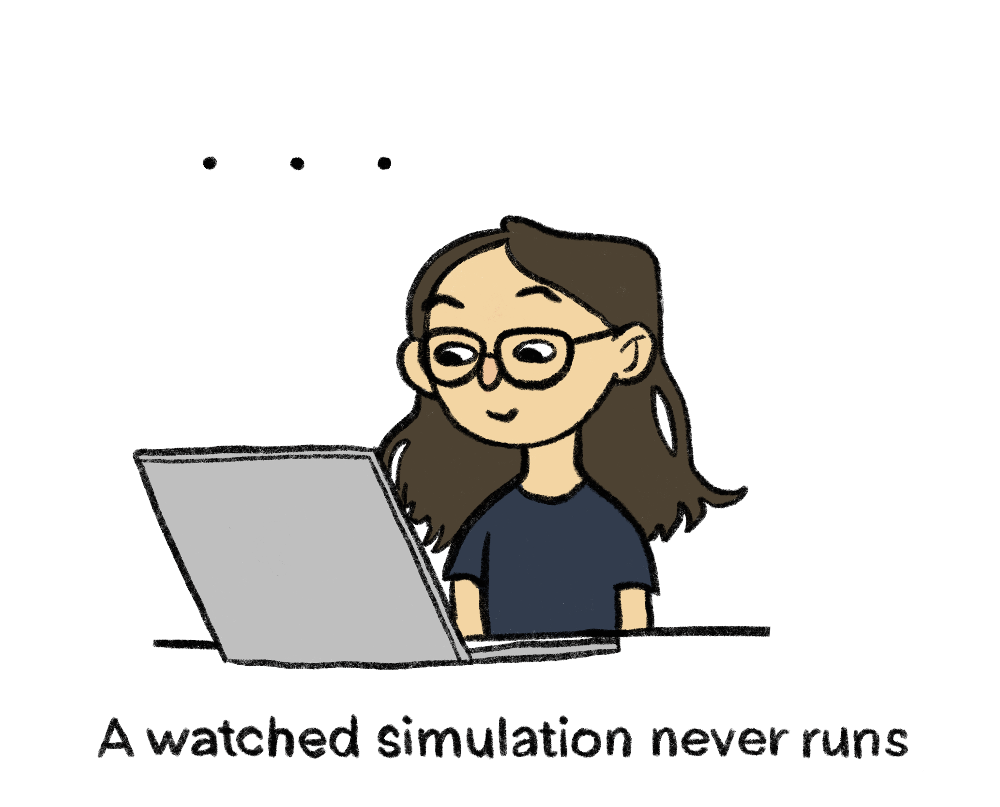
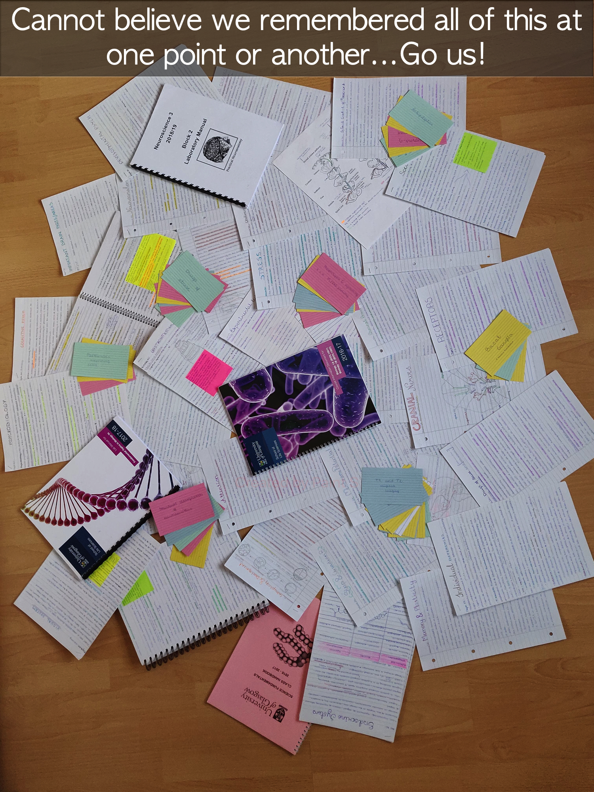
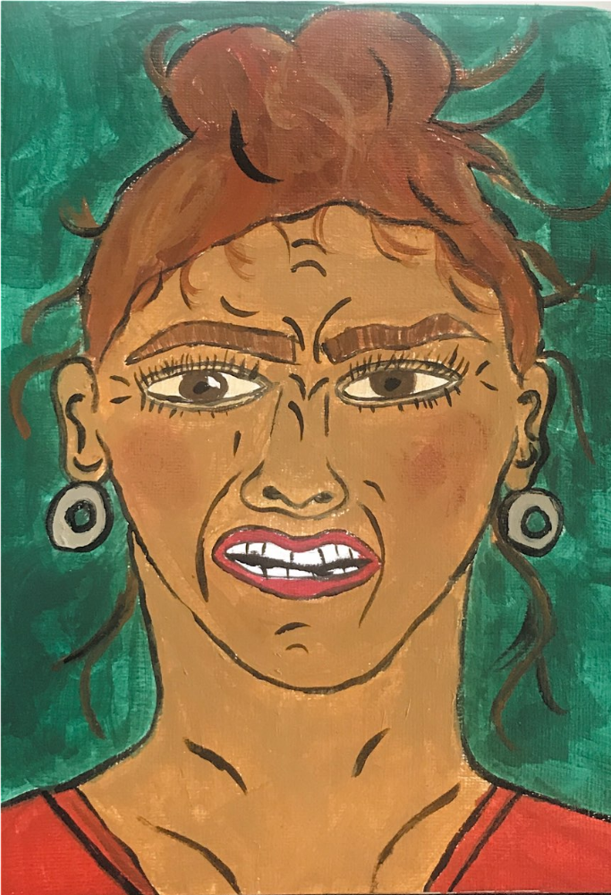
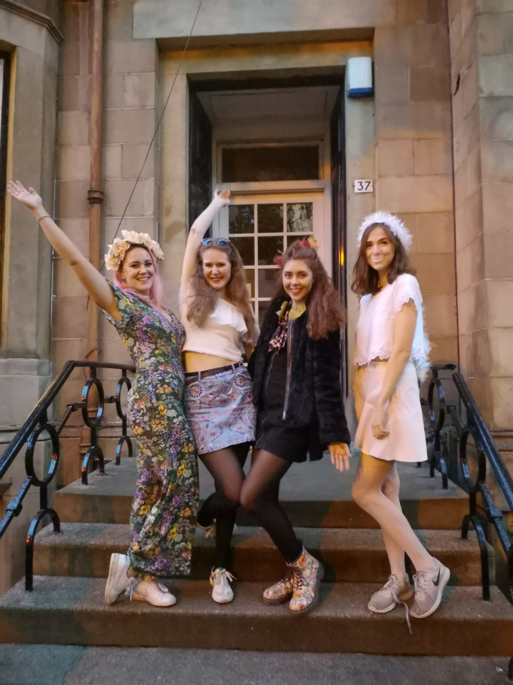
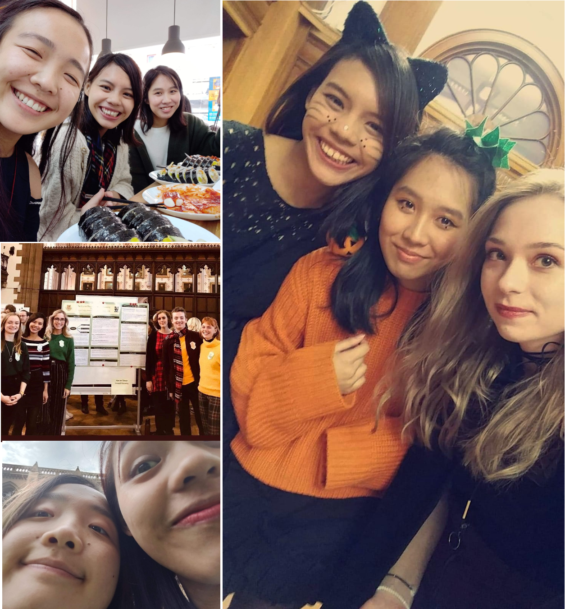

# Images of your time with us {-}

In this section you will find images and photos that people submitted to represent their year, their friends, and their dissertations.

## Us & Our Time! {-}

**Perfect or Good by Grace Furnell**
 
 

 

---

**Simulations by Mandy Norrbo**
 
 

 

---

**Dreadlocks: Before Dissertation And After Dissertation by Ross Keegan**
 
 

 

---

**We Learnt This by Kroot Soomets**
 
 

 

---

**A Face by Leah Statham**
 
 

 

---

**Seasons by Aischa Reinken** (Left to Right) Cheyenne Lückemeier, Aischa Reinken, Ebba Magnusson, Mandy Norrbo Aischa has also contributed a poem called **Seasons** to this book.  

 

 

---

**Completed by Jessica Kenny** Jessica has also contributed her slides from the talk she would have given on this topic.   See it under **Our Studies!** section.  

 

 

---

**Collage by Marleen Lomann**
 
 

 

---

**Online Learning by Grace Furnell**
 
 

 

---

**Friends by Jinin Cheung**
 
 

 

---

**At the Party by Grace Furnell**
 
 

 

---

**Groups by Perrin Yan**
 
 

 

---

**Lasting Friendships by Vilte Noreikaite & Judy Chu** We met in psychology lab when we were in our 1st Year at University.  And we have been best friends ever since.  

 

 

---

**All the essentials while studying at UofG by Marine Fleury**
 
 

 

---

**Friends for life by Antonella and Belen**
 
 

 

---

**Timo Schnabl**
 
 

 

---

**Calum Lindsay, Shahrukh Gill, Kalina Stefanova and Magdalena Qenani **
 
 

 

---

**Clare McAteer**
 
 

 

---

