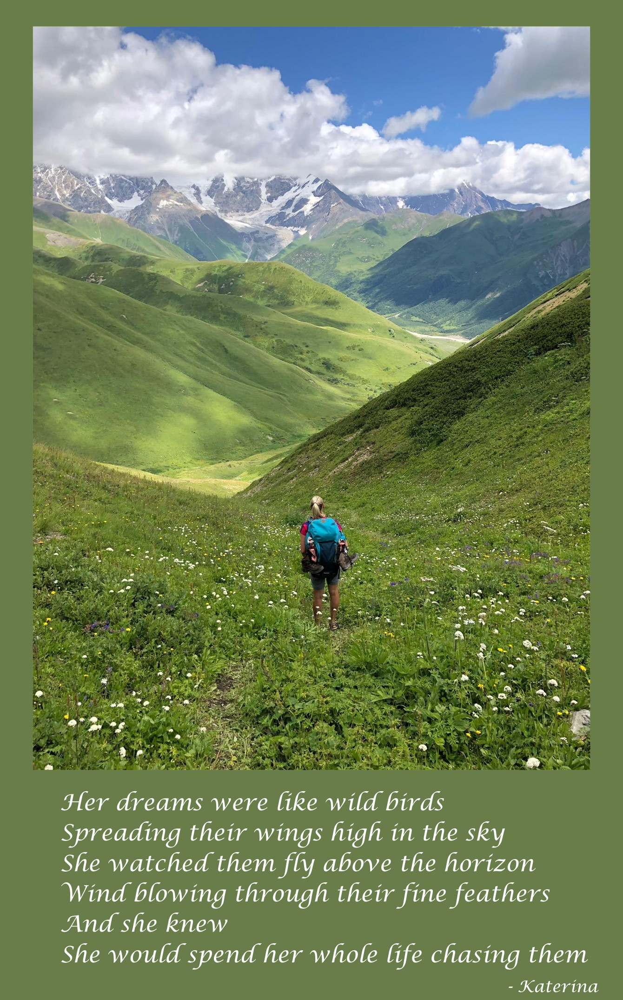
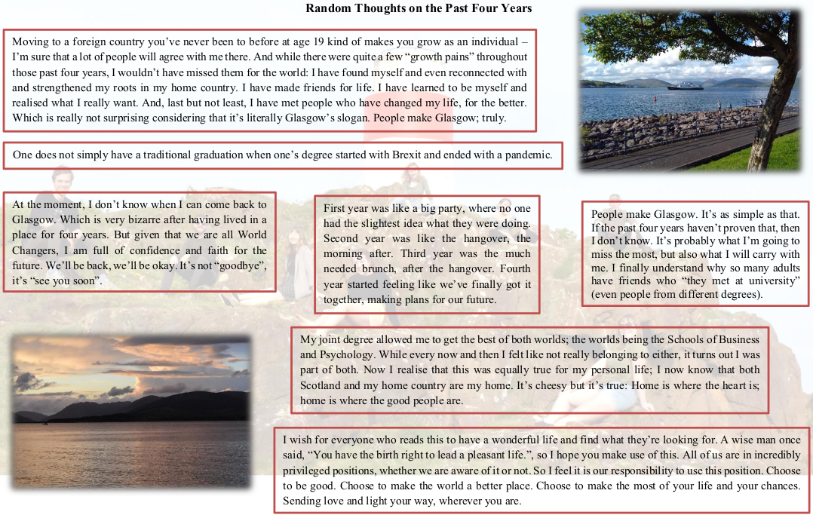
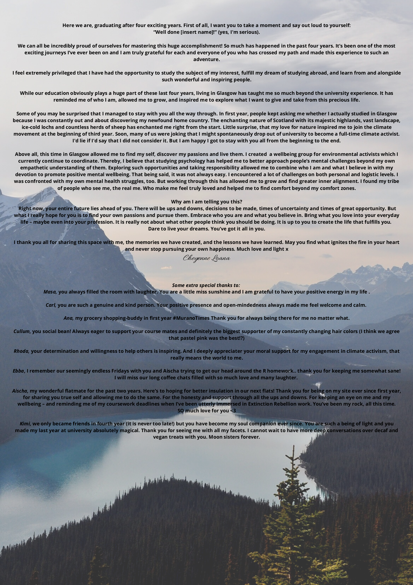
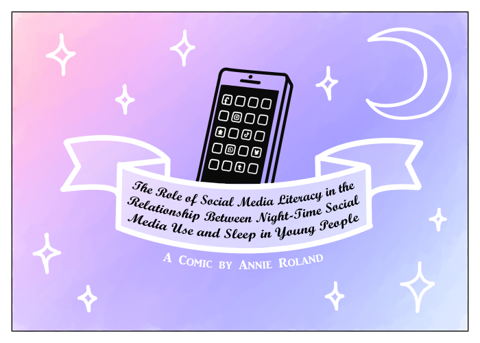
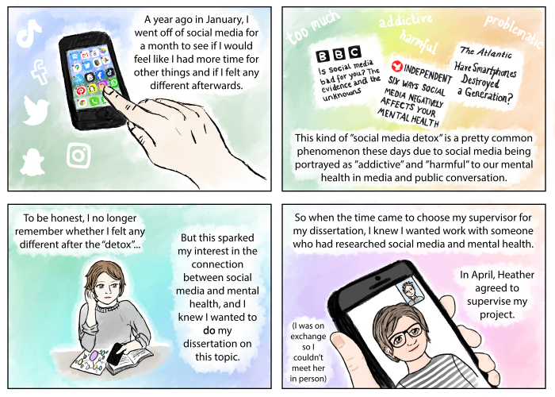
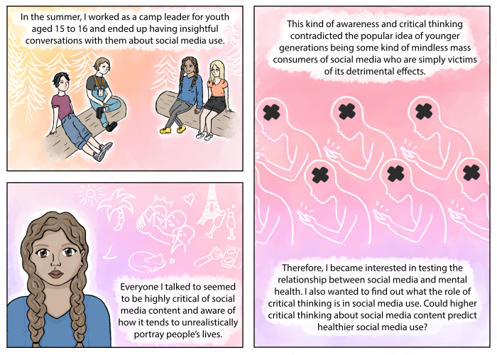
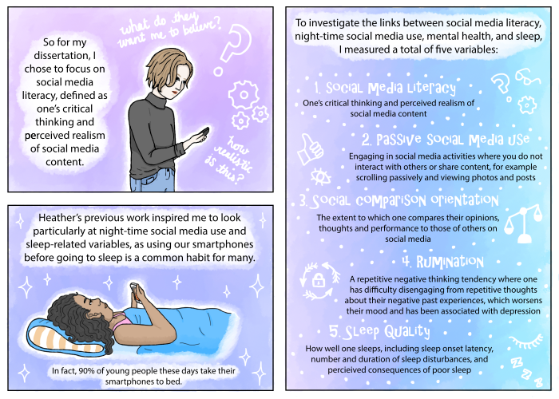
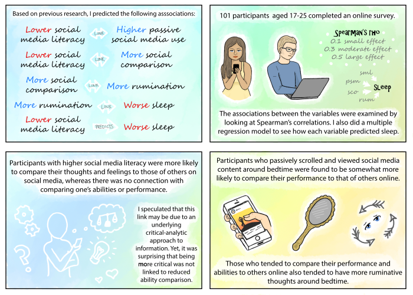
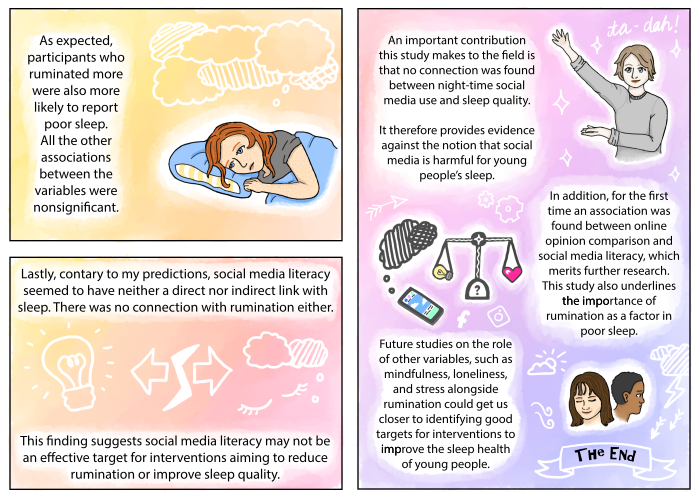

# Poems, Letters & Stories {-}

In this section you will find poems, letters & stories that people submitted to represent their dissertations, their year, and their experiences!

#### From Morgan Daniel {-}

<strong>Dear Class of 2020, </strong>

When thinking of a way to summarise my time at the University of Glasgow and an appropriate way to pay tribute to my experience as a Psychology student, I really struggled to think of how exactly that is possible. Glasgow, as both a university and a city, has given me far more than I know how to express through words (or any other of the more creative methods suggested). Instead I want to take the opportunity to say thank you to a few people who deserve recognition for helping me struggle through until this point.

Firstly, to all of my classmates, thank you so much for everything over the past 4 years. I literally would not be at this stage without all of your support, the tears that we have shared, the good luck messages and post-exam pints.

Thank you to the psychology and neuroscience students for all of their support, particularly over the past 2 years. We have collectively experienced a LOT of stress and I am constantly inspired by the work ethic and academic ability that every single one of you have. I am so thankful to have made such wonderful friends and to have been there for each other throughout this degree. Never again do I want to experience the level of stress and sleep deprivation that 3rd year caused, I’m glad that all of you were by my side.

A huge thankyou is owed to all of the students who made this final year of university so enjoyable, despite disruption from strikes and a global pandemic. My dissertation group were amazing and I loved our weekly cups of tea and frequent rants (mostly dissertation related, but not exclusively). I owe so much to my dissertation supervisor, Niamh Stack, not only for the chocolate ginger biscuits, but also for her guidance throughout the year. I also feel blessed to have worked with some of the third year students who I otherwise likely would not have met. Groupwork was far more enjoyable with such a lovely bunch of people.

My dissertation participants, staff working in a care home local to Loch Lomond, deserve a massive shout-out, not only for taking part in my dissertation and for being such a great laugh, but also for everything that they are currently experiencing. COVID-19 has caused a crisis among UK care homes, and the staff at this care home in particular have been amazing in their handling of the situation. They have provided updates on residents, kept them busy by doing arts and crafts, and have been actively updating the facebook page to show families that their relatives are doing well and are in good hands. I have to say that none of this surprises me having met such lovely people during the process of my dissertation and having witnessed the care that they provide. They really are remarkable people and deserve to be recognised for the work they do every single day.

Finally, to the staff within psychology and neuroscience, thank you for all of your help. I have learned so much from all of you and have always been given your full support (thank you for always providing a reference when I asked for so many of them). Lecturers, course co-ordinators, admin staff and others were always so positive and encouraging.

I am so sad that we didn’t get to say goodbye as a class as we had hoped, but I hope that we get our chance at a later date when we are all slightly more grown up, perhaps almost professional, adults…? I will miss you all and I feel so lucky to have been part of this class. See you in beer bar as soon as possible.

<strong>Morgan Daniel x</strong>

 

---

#### Seasons by Aischa Reinken {-}

<strong>Seasons</strong>

In first year, leaves were hues of red, orange, pink salt   So bright, we fluttered towards them like moths  -zing, too hot, we tried to not get burnt  but it was muddy, and we had no wellies. 

In second year, we vowed  this was gonna be the year  we were gonna join at least one society,  go out at least once a month, and - make friends. 

But the nights were longer than the days,  Hogwarts cold and grey and hungry, and loneliness  as desperate to be our friend as we were supposed to be for a night at Hive. 

But- it wasn't all bad  We fell in love, ungracefully,  and marched the cities veins  in big and bold colours  with bigger and bolder people. 

In third year, we hopscotched on rooftops  And watched the city empty and fill its dirty lungs.  We liked the gentleness of warm afternoons in the park, and  The blatant optimism of bare legs on sunny days.  But we didn’t like the hustle;  It pulled up wobbly skyscrapers in our chests.  Nevertheless, as days got warmer, we relaxed into what we were  And not who we could become. 

In fourth year,  -we hid.  From looming decisions about medium-sized futures,  From the D-word and an invisible sleeping dragon.  We had promised ourselves yet again  To take it all in this year, our last year,  As our attention waivered from one lecture to the next Instagram story. 

But the dragon awoke  Breathing fire on mistakes and memories to be made,  Leaving shreds of fear and regrets.  Why had we not made more time?  The tree outside my window whispers:  Because you did not give yourself permission to. 

What will we do next year?  I, for one, will live ma vie on my own pepper terms. 

<strong>Aischa Reinken</strong>

 

---

#### A Poem by Chiara Wilke {-}

I don’t know how you do it.  To always be so beautiful?  I don’t know how you do it.  To always be so brave? 

I don’t see why you do it?  You will hurt me over.  I don’t see how you do it.  To always be pretend. 

You’re so precious, are so fake.  A beautiful hallucination.  You’re so confident and great.  But nothing more. Just all facade. 

<strong>Chiara Wilke</strong>

 

---

#### Verses by Katerina Hartmanova {-}

 

 

---

**Random Thoughts on the Past Four Years by Kim Rosenberger** Download <a href="images/KimRosenberger.png" target = "_blank">a larger image from here</a>
 
 

 

---

#### 1300 days of University by Ricarda Senger {-}

<strong>“I would never choose to run a study where I have to test participants in the lab. An online questionnaire is just so much easier, less time-intense, and a thousand times more comfortable.”</strong>

This is a quote from myself when I contemplated what sort of Maxi project I would want to do. Well, guess who ended up in a tiny lab of the Hillhead Psychology Department nearly every day for about two months. Yes, that was me, testing 160 people ...

Read Ricarda's full story by <a href = "images/RicardaSenger_MyStory.pdf" target = "_blank">clicking here for a pdf copy</a>

 

---

#### Graduating by Cheyenne Loana Lueckemeier {-}

 

Read Cheyenne's full story by <a href = "images/CheyenneLueckemeier_MyStory.pdf" target = "_blank">clicking here for a pdf copy</a>

 

---

#### A Comic by Annie Roland {-}

Download a copy of this story by <a href = "images/AnnieRoland_comic.pdf" target = "_blank">clicking here for a pdf copy</a>

 

---

#### From Grigoris Kokkinidis {-}

<strong>Dear Class of 2020, </strong>

Imagine it’s September 2016. Imagine walk into the first psychology lecture, those 9am lecture in the magnificent Bute Hall that had us all in owe of this University. Knowing how the next four years would develop, would you change anything? Because I wouldn’t.

It’s true, this is not the ending any of us expected. I was expecting to have spend the last two months surrounded by friends and fellow graduates. Celebrating by great nights out and travelling, and sharing funny, and maybe stressful memories of the last few years as undergraduate student at the University of Glasgow. I was expecting a suit, and a gown, and to marvel at how good everyone looked for once, after not caring about whether we wear are pyjamas to the library to finish our dissertation and study for exams. I was expecting my whole family to be here and celebrate with me -and trust me the only person more upset than me that this didn’t happen is my mom. I didn’t have that. We didn’t have that. And that is annoying and yes, unfair. But the thing is that we still have all those things even if not us we expected. We still have those friends we are sharing these experiences with. We still get to call ourselves UofG graduates Class 2020. We still get to feel proud of what we’ve achieved, and we should, because we’ve not only achieved this, but we’ve done so under extraordinary circumstances. We still get to feel thankful for everything and everyone that support us in our way to graduation. We still get to reminisce about those first days in a pool of 500 students. And potentially most importantly, we still get to celebrate. Be it now, be it when this whole COVID situation is over. Be it surrounded by friends and family or lying in bed in self-isolation thinking “I did that”. Be it happy, or bittersweet. We are there.

I am proud to be able to say I am a graduate of Class 2020. I am proud to have met all the wonderful people and have experienced every single amazing thing that the last four years have brought in my path. I am thankful to all the people who have supported me and who have made an incredible contribution to ensuring I get here. All the students, staff, family, dogs, that random person who told me one night in first year that I should believe in my heart and change my degree to Psychology.

So, as I close this essentially rant, I’m raising a glass to all of us. We did this. Raise a glass with me.

Congratulations UofG Psychology Class of 2020.

<strong>Grigoris Kokkinidis</strong>

 

--- 

#### From Alexandra Bobchinetskaya {-}

<strong>A little note to my dearest UofG friends, </strong>

As with much of my university work, I procrastinated writing this yearbook note. However, this time my procrastination came from having absolutely no clue how to summarise the amazing, crazy, rollercoaster ride of an experience that I had here at UofG, so I’ll keep it simple.

Thank you everyone at the University of Glasgow for making this place, this community so special. I will never forget how friendly, approachable, and down to earth every single professor, staff member, library security, and student has been.

Thank you to my dissertation group (Annie, Imogen, Hannah, Lily, and Maryam), I will always remember our cute weekly tea chats and statistics meetings where we shared our code only to find out seconds later that our code doesn’t actually work. You guys made this time so special and so much more enjoyable for me, and I wish you all the best in your amazing and bright futures.

Thank you to my dissertation supervisor Heather Woods, who not only supported me through my final year, but also encouraged an introvert like me to make the most out of the time I had left here by getting involved and chair my first ever panel event?! I don’t know what came over Heather to trust me to do that but I am so grateful that she did. Get yourself a supervisor who pushes you out of your comfort zone. ;)

And lastly I want to thank my dearest Ricarda, Bairavi and Maggie, with whom I’ve shared so many laughs and amazing dinner nights that I will never forget. Adamski, my Polish brother, thank you for sharing this weird and testing time with me, though you don’t really have the choice because we literally make the same life decisions anyways. And Isabelle… girl, you are my rock. You’ve been my support from day 1, I am so grateful that I ended up in Flat 6A, I can only hope to be half the friend you were to me.

I have many others to thank but you know who you are!

<strong>Alexandra (Sasha) Bobchinetskaya</strong>

 

--- 
