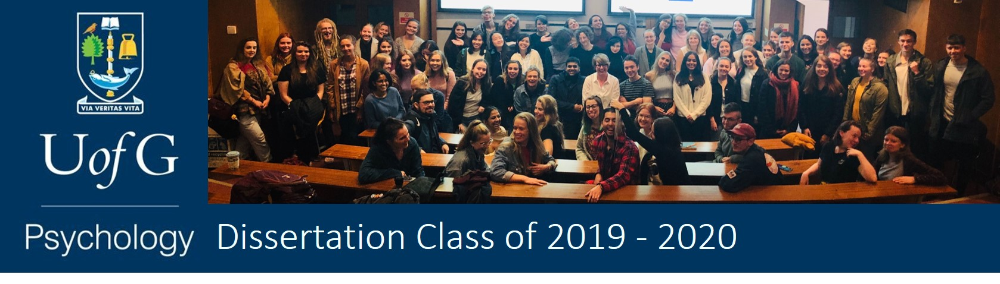
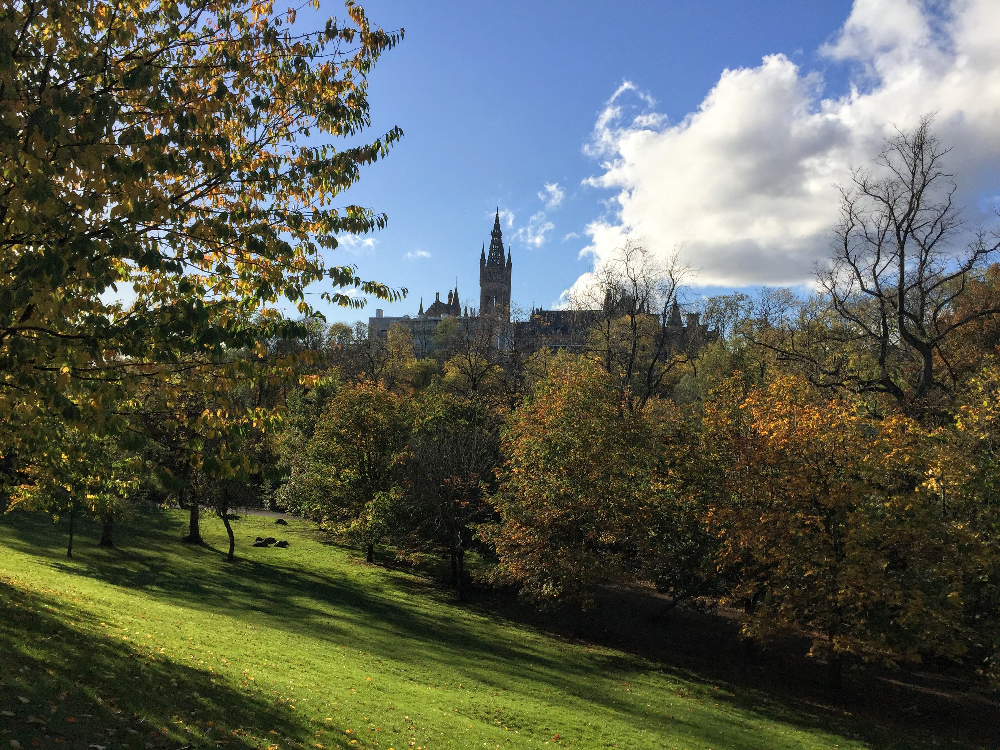

--- 
title: "Dissertation Yearbook 2019-2020"
subtitle: "School of Psychology, University of Glasgow"
site: bookdown::bookdown_site
documentclass: book
bibliography: [packages.bib]
biblio-style: apalike
link-citations: yes
description: yearbook-twenty-ninteen
---

# Class of 2020 {-}

Yearbook for the University of Glasgow School of Psychology 2019-2020. 

**Programme Lead:** Dr Heather Cleland Woods.

We hope you enjoy these snapshots of your time studying Psychology at Glasgow. If you have any images, stories, photos, or summaries of your dissertation you would like to add or contribute, please send it via email to [heather.woods@glasgow.ac.uk](mailto:heather.woods@glasgow.ac.uk).

---

**Class of 2020**
 

 

---

**Autumn in Glasgow by Aleksandra Tymochin**
 
 

 

---
